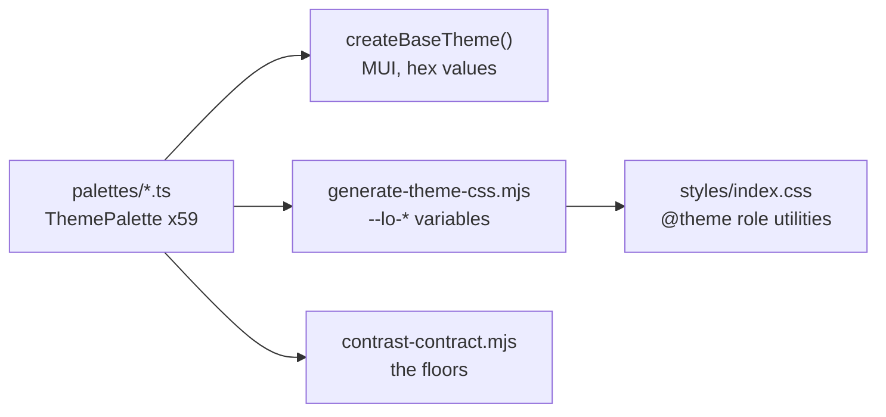

# Branding and design system

The visual and verbal system for the Local Operator desktop app, and the rules
that keep it consistent as it changes.

This is the app-side companion to the design kit that owns the marketing site
(`docs/design-kit/` in the `local-operator-site` repo). Where the two disagree
about the brand, the kit wins; where they disagree about *how a desktop app
should behave*, this file wins, because a tool read for hours at arm's length is
not a page read once.

**Read this before changing any visual surface.** The parts of this system that
are enforceable are enforced by `pnpm check-themes`; the rest is here because a
rule nobody wrote down gets re-litigated every quarter and re-broken every
release.

---

## 0. The one sentence

> The audience has used a chat assistant. They have not used a build tool.

Every rule below follows from that. The app runs agents that write and execute
code on your own machine — genuinely technical machinery — for people who
describe their problem in a sentence. The interface's job is to make the
machinery *legible* without making it the subject.

The failure mode this system exists to prevent is an app that looks like a
terminal wearing a GUI: dense chrome, monospace everywhere, every internal step
of the agent's reasoning shown at equal weight to the answer.

---

## 1. Architecture: where colour comes from

One source, two consumers. Do not add a third.

- **`src/renderer/src/shared/themes/palettes/*.ts`** — the single source of
  truth. Fifty-nine `ThemePalette` objects, 31 roles each, every value a literal
  string.
- **MUI** consumes them as hex, because roughly 299 `alpha()` call sites need a
  real colour and cannot take a `var()`. This half shrinks as the port
  continues.
- **Tailwind** consumes generated CSS variables. `pnpm gen-themes` writes
  `styles/themes.generated.css`; never hand-edit it.
- **`pnpm check-themes`** verifies the generated file is current and that every
  palette clears the floors in § 3.

The theme provider sets `document.documentElement.dataset.theme`. That attribute
is what every Tailwind role utility resolves against — without it, the ported
half of the app renders unthemed.

### Why roles rather than colours

Fifty-nine themes are user-selectable, and a "Dracula" theme is a promise to a
user.
Overriding community palettes with brand green would break exactly the users who
chose them. So the brand ports as **roles with contrast floors**, not as values:
the two `localOperator*` palettes *are* the brand, and the other fifty-seven
only have to satisfy the contract while keeping their own identity.

A component never names a colour. It names a role — `bg-surface`,
`text-ink-muted`, `border-control` — and the theme decides what that is.

---

## 2. Colour

### The four grounds

`canvas` (page) → `surface` (cards, panels, inputs) → `elevated` (menus,
popovers, tooltips, hovered rows), plus `sunken` (wells, tracks, code grounds)
recessed below canvas.

There is a fifth ground role that is **not** a rung on that ladder: `highlight`,
the ground of a row the reader is currently ON. It is a **lightness** step off
`surface` in the direction the mode runs — darker on light themes, lighter on
dark ones — and it is authored to land at **ΔE00 4.0 or better from `surface`**
(the twelve palettes this change was authored against measure 4.01–4.15, and the
forty-seven the theme port added were brought to the same rule in that round:
**4.00–5.97 across the tree**, where the loudest is now `rosePine` 5.97 and
`cyberpunk` — the palette whose cast the rule's fixed fraction first blew out to
ΔE00 10.35 — sits at 4.14. Six palettes' `L*` shortfall is pinned where their own
ink caps the route, and one wash pair is pinned where the floor is unreachable).
The role was first authored at
**2.0–2.5** for a selection the operator had asked to be subtle; he has since
seen it rendered and reported the current row as invisible beside a hovered
neighbour, and the band was raised in the same change.

**The axis is lightness, and that is asserted rather than described.** ΔE00 is a
budget with a chroma term in it, so a step can be made as large as you like by
warming it at a fixed `L*` — which is how the first version of the raised band
answered the same report twice: on `tokyoNight`, `localOperatorDark` and
`localOperatorLight` the whole of the ΔE00 gain was chroma, and the `L*` step off
the panel **fell** to 2.61, 2.82 and 2.52 — *less* light on the two dark themes
than the 3.26 and 3.47 steps he had already reported as invisible. Those three
were re-authored to **+5.09, +3.81 and −4.75 `L*`**, and
`scripts/contrast-contract.mjs` now asserts both halves of the direction (a dark
palette's row is lighter than its panel, a light one's darker) and a floor of
**3 `L*`** on the magnitude, so no palette can satisfy the band while landing
darker on a dark theme. The twelve carry 3.81–6.62 `L*` today.

A selection is a mark on a panel, not a hole in it: `sunken` is always recessed
and measures 3.75–14.94 from `surface`, which is a dark box rather than a
highlight, and it is the role 97 `*-sunken` utility occurrences across 66 files
under `src/renderer` depend on being deep (85 live class usages and 12 inside
prose, the palettes and the generated stylesheet excluded).

A mark also needs to survive the pointer, and a ground cannot do that alone: the
ink floors on `highlight` cap how far it can climb (the caps and the `· lopdev`
binding inside a current row are drawn in `ink-dim`), while the hover step the
rows around it carry is `elevated`, which is also every menu, popover and tooltip
ground in the app — so on **eight of the twelve** palettes it is still the LARGER
step off `surface` (up to 6.25 on radient, against a mark of 4.01–4.15).

**That ordering is the rule, not a shortfall of this role.** A current row's mark
is the ground plus **`font-medium`** — the weight the settings rail's active row
already carried and the app rail's active item carries, so the app has one "you are
here" idiom rather than two — and it is NOT required to out-step the hover of the
row beside it: the pointer is a transient state on a neighbour and the mark is the
persistent one, and that is the trade the two roles make deliberately. What the
rule does not answer is the arrangement the operator's own screenshot is taken in —
the pointer beside the selection, the two bands one above the other, with the louder
of them the transient one. That needs a role this contract does not have: a
**row-hover ground** that steps less than `highlight` on the dark palettes, with
`elevated` left to the menu, popover and tooltip job it also holds. On a dark
palette those two jobs want different magnitudes and today they are one role. Adding
it is a twelve-palette change with its own assertions and belongs to its own change
rather than to a remediation round of this one; until it exists, the ordering above
is stated here rather than left to be discovered in a frame.

**There is no boundary on a current row, and that is a decision with a
measurement behind it.** An earlier round drew a 1px `outline-control` ring
beside the ground, and it is retired: `border-control` is § 2's *sole visual
boundary of an input, select, checkbox or outlined button* and a nav row is none
of those; no other role in the system carries a 3:1 structural floor; and the
ring rendered with the search field's own ink, height and radius one line below
the field itself, so the current row read as a filled input — worst on `iceberg`,
where a periwinkle ground inside a navy line reads as a disabled field. The
operator had already had that same boundary removed from the New chat row for the
read it produces. If a selection ever needs a third signal, that is a role this
contract does not have — add it there rather than borrowing one, which is the
rule § 1 states for every other missing value.

`highlight` is not in `check-themes`' `GROUNDS` list, because that list is the set
a control is drawn on one of at a time and every ink and structural border is
measured against all of it; a current row still sits INSIDE a `surface` panel. The
contract asserts what the row actually depends on instead: `highlight` against
`surface` at its own band floor of ΔE00 4.0 (so the mark is visible, and so that
its `L*` step runs the right way), against `elevated` and `sunken` at the field
floor of ΔE00 2.0 (so it is not confused with the pointer's own hover step and is
not the well below it), and `ink` / `ink-muted` / `ink-dim` on it at their usual
floors plus 0.15 of headroom. It no longer asserts `border-control` on it: there
is no boundary on the row (above).

**The rule a porting author follows**, so a new palette can be derived rather
than tuned: take the `L*` step **first**, at the panel's own hue, in the direction
the mode runs — as far as the ink floors allow — and then buy only the shortfall
to the band's floor of **ΔE00 4.0** on the chroma axis at that same hue. Chroma
may pay a remainder; it may not pay the step. The constraints:

- targets **ΔE00 ≥ 4.0 from `surface`**,
- keeps every ink floor with at least **0.15 of headroom above it** — `ink` ≥
  7:1, `ink-muted` and `ink-dim` ≥ 4.5:1 on the row's own ground, and
  `ink-dim` is the one that usually binds, because the caps and the `· lopdev`
  binding inside a current row are drawn in it — and
- stays **ΔE00 ≥ 2.0 from `elevated` and from `sunken`** (the field floor § 3
  enforces; 2.2 is the target to aim past, being where the original band's
  separation was measured).

Four of the twelve still carry a partly chroma-bought step — `dracula` 1.20x the
panel's chroma, `monokai` 1.66x, `obsidian` 1.90x and `iceberg` 3.31x — each
recorded at its own value in its palette. They clear the asserted floor, and they
are what a re-authoring should take next: `iceberg` is where the cost is visible,
because that panel is the least chromatic of the twelve (C* 1.57), so its step
reads as a lavender band rather than a darker row (design round 1, D4). Its
earlier justification — that its recessed ground capped the step — was wrong:
`sunken` sits ΔE00 3.75 from that `surface` and the row still clears it by 2.53.

**Elevation is a lightness step, not a shadow.** There is exactly one shadow in
the system and it belongs only to objects that leave the flow: menu, dialog,
drawer, popover, tooltip, select. An in-flow card that needs to feel raised
takes the next ground, not a shadow. This is why the four grounds must be
mutually distinguishable, and why `check-themes` asserts it.

### The four inks

`ink` (primary) → `ink-muted` (secondary) → `ink-dim` (captions, metadata,
placeholders) → `ink-disabled`.

`ink-disabled` is the only role exempt from a contrast floor, because a disabled
control that meets 4.5:1 does not read as disabled.

### The structure ink that is not in the ladder

`tokenCommand` is the fifth required ink and it is deliberately outside the
ladder above: it never carries prose. It is the composer's syntax highlight —
the slash word the app is about to RUN, the desktop twin of the TUI's
`$lo-signal` — so its job is to be distinct from the three inks it is read
against IN ONE LINE (`ink` for the instruction, `accent` for a live turn,
`success` for a roster name) rather than to sit at a step in a hierarchy. Floors
are per-palette and measured on the composer's own ground: at least 4.5:1 on
`surface` and on `elevated`, and at least **ΔE00 8 from `ink`, `accent` and
`success`**. `obsidian` is the one pinned exception — its `info` IS its `ink`, so
there the run is separated by the painted weight step alone.

Beside the ink, the run carries that weight step (`slash-run-bold`, a 0.5px
text stroke — one constant width at every raster, not a per-display band). It is
a STROKE and not a `font-weight` for a layout reason: the
mirror paints every glyph while the textarea's own text is transparent, so the
two layers have to wrap at the same character, and a real weight change moves
the advances — which wrapped the mirror earlier than the textarea and hid the
tail of the user's draft behind the mirror's own overflow (measured: 65 of 78
typed characters). Add a run ink here and give it the same treatment.

### The two lines — the distinction people get wrong

- **`hairline`** is decorative: section rules, table separators, list dividers.
  It carries no information and has no floor.
- **`border-control`** is structural: the sole visual boundary of an input,
  select, checkbox, or outlined button. Floor 3:1 on all four grounds.

Most palettes ship one border colour and use it for both jobs. That is how the
old light theme ended up bounding every input in the app at **1.25:1** — the
control's only edge, effectively invisible. If you are adding a boundary, ask
whether removing it entirely would lose information. If yes, it is structural
and must clear 3:1. If no, delete it rather than reaching for `hairline`.

### Accent

One accent, spent about **three times per screen**. Primary action, active
state, focus ring. A second decorative hue is not available.

If a screen needs the accent a fourth time, something on it is not as important
as it thinks.

### Semantic

`success`, `warning`, `danger`, `info`, each a triple of colour, `-wash` (the
faintest tint, for the ground of a callout) and `-border`.

All three parts are authored per theme rather than derived, because deriving
them is what lets MUI's `augmentColor` invent an Alert's appearance — once per
theme, differently.

Four semantics means four **separable** hues. `info` used to be the accent's
own triple in the two brand palettes, on the theory that a fourth semantic hue
is a hue nobody can name. A hue nobody can *distinguish* is the real defect,
and that is what it produced: `success` and `info` sat ΔE00 2.2 apart in the
light brand palette and 5.1 in the dark, whose washes were byte-identical. A
user asked to tell "it worked" from "here is a fact" by colour cannot do it
when the two colours are the same colour. The accent budget above governs how
often the accent is *spent*; it never meant a semantic could not exist. The
brand palettes now separate `success` from `info` by ΔE00 38.9 and 41.0, and
the weakest pair anywhere in the system is sage at 8.4.

---

## 3. The floors — enforced

`scripts/contrast-contract.mjs`, run by `pnpm check-themes`. Per palette:

| Assertion | Floor |
|---|---|
| `ink` on each of the four grounds | 7:1 |
| `ink-muted`, `ink-dim` on each of the four grounds | 4.5:1 |
| `accent` and each semantic colour as text on canvas and surface | 4.5:1 |
| `on-accent` on the accent fill | 4.5:1 |
| `border-control` on each of the four grounds | 3:1 |
| Any two grounds, mutually | 1.03:1 |
| `highlight` against `surface` | ΔE00 4.0 |
| `highlight`'s `L*` step off `surface`: the direction, and at least 3 `L*` | 3 `L*` |
| `highlight` against `elevated` and against `sunken` | ΔE00 2.0 |
| `ink` / `ink-muted` / `ink-dim` on `highlight`, with 0.15 of headroom | 7:1 / 4.5:1 / 4.5:1 |
| Component triples: ink on its own fill | 4.5:1 |
| Component triples: edge (fill **or** border) against the ground behind | 3:1 |

`ink-disabled` is the only exemption.

That grounds row is a floor, not a promise that anyone can see the step. 1.03:1
is a luminance ratio, and two grounds can clear it and still read as one
surface — the light brand palette cleared it while rendering a plain card on
canvas invisibly. The perceptual test is ΔE00, and the threshold observed in
the captured theme frames is about **2**: sage renders that card at 1.9 and
iceberg at 2.1, where the brand palette at 1.5 did not. Aim for 2 or better on
adjacent steps. The cheap way to buy it is § 2's warm ramp rather than more
lightness: ΔE00 has a chroma axis and a contrast ratio does not, so separating
two grounds by warmth at a fixed `L*` costs no assertion in this table, while
separating them by lightness costs every ink measured against them.

**Component triples are the assertion that matters most.** A pair checker passes
a control whose fill is 1.06:1 and whose border is 1.20:1 — each token is
"fine", and the control has no perceivable edge. Adding a component to the app
means adding a row to `CONTROLS` in that script; green output about a component
nobody listed is not evidence about that component.

**Exemptions are pinned, not muted.** An accepted sub-floor pair records its
measured ratio, so moving the token breaks the pin and forces a human to
re-approve it.

What the script cannot see: alpha composites, gradients, text over images, and
any colour a third-party widget (ag-grid, CodeMirror, mermaid) picks for itself.
Those need a human and a screenshot.

---

## 4. Type

| Step | Size | Use |
|---|---|---|
| `text-display` | 28px | The largest text in the app. A page title, not a headline. |
| `text-title` | 20px | Section and dialog titles |
| `text-heading` | 16px | Group headings, card titles |
| `text-body` | 14px | Default body |
| `text-body-sm` | 13px | Dense rows, secondary panels |
| `text-meta` | 12px | Captions, timestamps, counts |
| `text-mono` / `-sm` | 13px / 12px | Machine voice only |

The site's display steps are deliberately absent. A desktop app has no hero, and
a 60px headline in a tool is a marketing device applied to a working surface.

**Monospace is machine voice.** Paths, code, counts, timestamps, trace labels,
identifiers. It is what lets a tool trace read as machine output without needing
a box drawn around it — which is most of how the trace redesign buys its
quietness. Monospace for emphasis, or for prose, is forbidden.

---

## 5. Space, radii, motion

**Space** is a 4px ramp, grouped in three tiers: 4/8 within a component,
12/16/24 between components, 32/48/64 between sections. Consistency of tier
matters more than the specific value — mixed tiers are what make a layout look
unconsidered.

Default to more air and less chrome. When a panel feels busy, the fix is almost
always removing a border or a background, not tightening the spacing.

**A component does not own its outer margin. The container owns the gap.**

A component that ships `mb-4` cannot be composed: it stacks with every parent
that has an opinion, and the failure is silent because the result is still
*some* spacing, just the wrong tier. That is exactly how every settings form in
this app came to sit at 32px between fields — a component's own `mb-4` plus its
container's `gap-4` — which is section-tier spacing on component-tier content.

Margins between a component's own internals are fine; it is the **root element**
that must be free. If every caller genuinely wants the same spacing, that is
still a container concern, not a reason to keep it.

**Radii**: 2 / 6 / 10 / 14 / 16, and nothing else.

**Radius is assigned by what the object is, not by what looks good on it in
isolation.**

- **6px, controls.** Anything you click or type into — button, input, select
  trigger, textarea, tab — plus the small blocks that live at control scale:
  tooltip, badge, skeleton. A 32px-tall control cannot carry more: 10px eats a
  third of its height and reads as a lozenge, and every desktop tool that feels
  precise sits at 4–6.
- **10px, panels and callouts.** Things that sit over or beside content and are
  read as one block: menu, popover, select panel, alert.
- **14px, frames.** Cards and dialogs — the containers other things sit inside.
- **2px** is for bars too small to carry 6: the progress track, the scrollbar
  thumb, the checkbox.
- **16px (`frame`)** is for the two objects that span their whole column: the
  composer and the message bubble.
- **Nested radii are concentric, not repeated:** an inner radius is the outer
  radius minus the padding between them. The tabs track is 10 with 4px padding,
  so its pills are 6.
- `rounded-full` stays reserved for avatars, status dots and pill badges.

**Motion** — durations 80 / 120 / 180 / 240ms. Nothing in this app animates for
longer than 240ms, and only something entering the screen earns that.

- Transition `color`, `background-color`, `border-color`, `opacity`, and
  `transform` only for entrances.
- **Nothing lifts, scales, or translates on hover.** Hover is a colour step.
- Reduced motion is a contract: `styles/index.css` caps every duration at
  0.01ms. It **caps** rather than disabling, because a cancelled animation can
  strand an element on its `from` keyframe — which is how content ends up
  permanently invisible. (That exact defect shipped on the marketing site: 16
  elements with `opacity: 0` that never animated away under reduced motion.)

### Icons

**`lucide-react`, one stroke weight, and the weight is never written down.**

The weight is lucide's own default of 2. The rule is expressed as an absence —
`strokeWidth` does not appear on an icon anywhere in the tree — because a
default costs nothing to keep in sync and a restated value drifts. It already
had: five weights (1.5, 1.75, 2, 2.2 and 3) had accumulated across 18 call
sites while the other ~290 icon renders in the app sat on the default and
looked fine.

Lucide draws on a 24px grid and scales the stroke with the box, so one value
is one pen at different zooms. At the sizes below a 2 renders as 1px, 1.17px,
1.33px, 1.67px and 2px — from 14 up, that is the range where an icon still
outweighs the 1px `hairline` beside it and roughly matches the stems of the
500-weight label it weighs against. A 1.5 at 16px renders at exactly 1px,
which is what the chat header's canvas toggle was doing: an icon with the
visual weight of a divider.

**Sizes: 12 / 14 / 16 / 20 / 24.** These are not free choices. 14, 16 and 20
are the icon slots `Button` already defines, and an icon inside a control has
to agree with the control.

| Size | Where |
|---|---|
| 12 | inline with `meta`, and inside anything smaller than a 28px control — `badge`, the canvas tab's close button, the variables viewer's dense rows |
| 14 | `Button` `sm` and `icon-sm`; inline with `body-sm` |
| 16 | the default — `Button` `md`, `lg` and `icon`; list rows, nav items |
| 20 | `Button` `icon-lg`; a standalone glyph labelling a settings row |
| 24 | a page header, beside the `display` step |

**12 is where the one-pen rule bottoms out**, and it is on the ramp because
16 sites need it, not because it is comfortable. A stroke of 2 renders at
exactly 1px there — the weight the paragraph above calls a divider. It holds
only because weight is stroke times contrast: a `hairline` is the faintest
border in the system and a 12px glyph is `ink-dim` or darker. There is no
margin left below it. So the answer under 12 is to stop shrinking, not to
thicken — and there is now no site in the tree that goes lower: the keyboard
cap's glyphs are drawn at the 12px its own text is set in, and the
`inline-edit` footer, which used to pin them to 10px with `[&_svg]:size-2.5`,
scopes its override to the caps at `size-3` instead (design round 1, D5).

Above 24 is illustration rather than iconography: 28 in the onboarding
congratulations, 32 in the installer carousel and the two file dropzones, 48
in the error boundary and the agents empty state. It does not belong in a
toolbar or a row.

Sizes off this ramp still exist and are drift, not exceptions — 18 at eleven
sites, 19 at three, 22 at two, 26 at one. Every one of them is set through
lucide's numeric `size={n}` prop rather than a `size-*` class, which is why a
`size-*` sweep reports the tree as clean when it is not.

**When a glyph reads thin, change its size, not its stroke.** The checkbox is
the worked example: a 12px tick needed `strokeWidth={3}` to hold its weight,
so it became a 14px tick at the standard weight instead. One pen at four sizes
is a system; two pens is a defect a viewer notices without being able to name
it.

`strokeWidth` on a recharts `<Line>` is chart geometry, not an icon, and is
the one place the prop legitimately appears.

---

## 6. Focus, disabled, and the two rules people break

**Focus ring is `outline`, never `box-shadow`.** An outline honours
`border-radius: inherit` and is not clipped by an ancestor's `overflow: hidden`.
This app is mostly scroll containers, so a box-shadow ring silently disappears
in exactly the places keyboard users need it. `:focus-visible` only — a mouse
user clicking a button should not get a ring.

**Disabled changes colour, never opacity.** An opacity-faded control fades its
own background too, so the same disabled button lands on a different colour over
`surface` than over `sunken`, and neither was designed. MUI applies
`disabledOpacity` in eight components — AccordionSummary, Autocomplete, Chip,
ListItemButton, MenuItem, PaginationItem, Rating, Tab — and all eight are
neutralised in `base-theme.ts`. That list is written out so it can be re-checked
against a future MUI version rather than remembered.

---

## 7. Showing agent work: the trace hierarchy

This is the part of the app most likely to drift back toward a developer tool,
so the intent is written down rather than left to taste.

An agent turn can contain: prose to the user, a question for the user, a tool
call and its output, internal reasoning, and a security notice. Those are **not
equally important**, and the interface must not present them as though they are.

**The hierarchy, most prominent to least:**

1. **A question for the user.** The agent is blocked and waiting. This is the
   only thing on screen that needs a decision, and it must be unmissable —
   its own affordance, not a paragraph that happens to end in a question mark.
2. **The answer.** Prose addressed to the user, at full reading weight.
3. **What the agent did.** One line per action. Quiet, monospace, subdued ink.
   Enough to answer "what is it doing?" at a glance and to audit afterwards.
4. **How it did it** — code, stdout, logs, diffs. Behind a disclosure. Available
   in one click, never shown by default.
5. **Internal reasoning** — the `thinking` field, plus `reflection` and `plan`
   turns. Hidden by default. This is the agent talking to itself, and showing it
   at prose weight is the single biggest reason the app reads as technical.

**Rules that fall out of the hierarchy:**

- A completed action is **one line**. Not a card, not a bordered panel, not a
  header with an icon tile.
- A trace line names the action in the **user's** terms and the object in
  monospace: "Read `invoices/march.csv`", not "Executing Code".
- Prefer one disclosure idiom app-wide. Two competing expand/collapse patterns
  is a bug, not a style choice.
- Never show a spinner and a trace line for the same action; the line's own
  state carries it.
- **One liveness element per turn, and it is the working line.** A turn that is
  in flight but has produced nothing yet says so once, on the aggregate line at
  the foot of the transcript — never additionally as a row in the answer's own
  register. The line's ladder (`thinking`, `composing N calls`, `running …`,
  `responding`) already names every such state, and a record with no content in
  it paints nothing. This mirrors the TUI, which has one `WorkingBlock` and no
  per-message equivalent.
- **A row may only claim a position it can justify, and a finished conversation
  ends at its own last row.** Rows are placed by the time they carry, never by
  the moment the reader happened to see them: a replayed or seeded row the seed
  can attribute — one naming a call or a message — and that states no truthful
  time of its own is not painted at the reader's arrival, and nothing is appended
  under a conversation that has already answered. Where
  the row is already on screen, a late frame settles it in place rather than
  moving it. The failure this rule exists for is the one reported on 2026-09-15:
  a finished session whose lowest rows were `wait`/`bash` ledger lines from the
  previous morning, carrying the reader's own clock and painted under the answer.
  Implementation and evidence: `applyLiveSeed` / `withTimeOrder` in
  `transcript-reducer.ts`, `scripts/seed-placement.test.mjs`, and the
  before/after pair under `docs/evidence/chat-stale-seed-order/`.
- **Agent output shares the tool rows' edges.** Prose and the ledger are two
  registers of one turn and resolve against the same row content box, so they
  take one left rail and one right edge. Agent prose therefore carries **no
  reading cap and no centring** — the reading aside belongs to the user card,
  whose narrower width inside the shared measure is what makes a user turn read
  as an aside and the agent's answer read as the document. A cap on the answer
  puts a second left edge in the column, which reads as a mistake rather than as
  a decision. **The user card is an aside by its own width, not by a cap on its
  text**: the prose inside the card fills it and follows it as a reply quote or
  an attachment widens it. A measure on the text instead of on the box leaves
  the words centre-constrained inside a wider card, with equal slack on each
  side — an operator report from 2026-09-16.
  **If a reading measure is ever wanted back on agent output, it must narrow
  the whole row content box — prose and the ledger together, i.e. the shared
  `CHAT_MEASURE` container — never `max-width` on `.lo-markdown` alone.**
  Narrowing prose by itself re-creates the two rails this rule removes. The
  cost of not having one is recorded rather than hidden: 98.1 `ch` at the body
  step — an INHERITED figure, quoted as the arithmetic that argued the original
  removal rather than re-derived here; the same column carries 131 real
  characters on an 832.6px line — which is the ceiling and not a slope, because
  the content measure is capped at 900px and so reads the same at 1920 as at
  1024. The `ch`/character distinction is not pedantry: it is a 2.6× difference
  in what the number describes.
- A security notice is **retrospective** — it records that a risk was reviewed
  and averted. It must not be styled as a prompt, because nothing consumes a
  response to it.

---

## 8. Voice

Full treatment in the kit's `voice.md`. The rules that bite hardest in an app:

- **Say what happens, and on whose machine.** Name the files, the code, the
  computer. Describe events, not capabilities.
- **No jargon noun where an everyday noun works.** "Executing Code" is an
  implementation detail narrated at a reader who wants to know whether the thing
  helped them.
- **Every claim checkable, or cut.** No adjective doing a verb's job.
- **Errors say what happened, what it means, and what to do** — in that order,
  in the user's terms. An error that only quotes an exception is unfinished.
- **No emojis**, anywhere: UI copy, code, comments, commit messages.
- Sentence case for everything — buttons, headings, menu items, labels. Title
  Case is a marketing register and it makes a tool shout.

### Implementation traps

Three defects this system has already produced, each of which looked fine.

**`cn` is not optional.** Route every `className` through `cn` from
`@shared/lib/utils`. It registers our custom scales with `tailwind-merge`,
which otherwise classifies the type steps (`text-body`, `text-meta`, ...) as
*text colours* and puts them in the same conflict group as `text-ink` and
`text-ink-muted`. One of the pair is then dropped **silently**:
`twMerge("text-ink text-body-sm")` returned `"text-body-sm"`. The component
still looks right, because colour inherits from `body` — until it renders on a
ground where the inherited colour is wrong, at which point it looks like a
theme bug in a file nobody edited.

**Tailwind v4 namespaces are not guessable.** `duration-*` utilities generate
from `--transition-duration-*`, not from `--duration-*`. A token in the wrong
namespace compiles to nothing at all — no error, no warning, the utility simply
never appears and the element animates at Tailwind's stock 150ms. If a utility
seems not to apply, check that it exists in the compiled CSS before assuming
the value is wrong.

**MUI wins cascade fights during the migration, and specificity is not the
reason.** Emotion injects its styles *unlayered*, and an unlayered declaration
beats a layered one no matter how specific the layered one is. Tailwind's
utilities and this app's base rules are all layered. So a rule authored in
`@layer base` loses to `MuiButtonBase`'s `outline: 0` even at higher
specificity - and it loses in the most confusing possible way, applying its
`outline-width` and `outline-color` while `outline-style` stays `none`, so the
values are visible in devtools and nothing paints.

A rule that must beat MUI has to be **unlayered** (see the focus ring at the
bottom of `styles/index.css`), or carry `!important`. The `html` prefix is
still needed on top of that, to beat `.MuiButtonBase-root` on specificity once
both are unlayered.

This section previously said the `html` prefix alone was sufficient. It is not,
and that error is why the app shipped for a while with no keyboard focus ring
at all: the rule was correct, layered, and silently inert. Two further lessons
are worth keeping from that one bug. **Verify a global rule in a browser, in
the app** - not in Storybook, which renders a `<CssBaseline/>` the app does not
and therefore had a focus ring the product lacked. And **a verification surface
that differs from the product will eventually certify a defect**; when they
disagree, fix the surface first.

---

## 9. Adding something new

A short checklist, in the order that catches problems earliest.

1. Is there an existing primitive in `shared/components/ui/`? Use it. A second
   button implementation is a defect.
2. Name **roles**, never colours. If you are reaching for a hex, the system is
   missing a role — add it to the contract rather than working around it.
3. Pick radius and spacing from the ramps. Nothing off-ramp.
4. Does it need a boundary at all? If removing it loses no information, remove
   it. If it is the sole boundary of a control, it is `border-control`.
5. Does it need a shadow? Almost certainly not — take the next ground.
6. Check keyboard: focus visible, reachable, and not trapped.
7. Check reduced motion, and check the state the animation is supposed to leave
   things in when it never runs.
8. Run `pnpm check-themes`. If you added a component with its own fill and
   border, add it to `CONTROLS` in the contrast script.
9. Screenshot it in `localOperatorLight` and `localOperatorDark` at minimum. The
   light themes are where contrast defects hide.

### Disclosure

**The chevron swaps, it never rotates.** `ChevronRight` collapsed,
`ChevronDown` expanded, 14px, `text-ink-dim`. Rotation is a transition on a
toggle, and § Motion reserves transitions for entrances.

The canonical implementation is `@shared/components/ui/disclosure`. Import it.

Two places legitimately cannot: `canvas-variables-viewer` and
`chat-settings` both place action buttons as *siblings* of the trigger, and a
button nested in a button is not markup a browser can resolve. Reimplementing
the trigger is allowed there; reinventing the signal is not.

This rule exists because the codebase reached three disclosure idioms, two of
them carrying comments that each declared themselves "the app's one disclosure
idiom" - and they disagreed. The cause was structural: the canonical component
was buried in `features/chat/components/trace/`, so no other feature could
import it even when its author wanted to. A shared idiom has to live in the
shared layer or it is not one.

### A view that is not the newest one

Five states where the app is showing something other than the owner's current
answer, and each has one idiom because inventing a second at the call site is
how a system ends up with two ways to say the same thing.

**One register for the status slot.** Everything that says "the pane is not
authoritative yet" is `text-meta text-ink-dim`: the stale caption below and the
skeleton's label. The exception is `Reconnecting`, which stays
`text-body-sm text-ink-dim` because during the retry window it is the pane's
ONLY statement — there are no rows under it to carry the register — so it takes
the reading step rather than the caption step. Three type steps in one slot read
as three severities for one condition, which is what this rule removes.

**A caption, not a treatment.** A stale paint — rows read back from this
window's own memory while the snapshot is still in flight — stays at full
`ink`. No dimming, no scrim, and **no opacity**, which is banned as a state
signal here for the reason § 6 gives: it is unreadable on some grounds and
invisible on others. What says "this may be behind" is one sentence,
`text-meta text-ink-dim`, sentence case, no spinner, no icon tile, no border,
no shadow. It is present from the first painted frame and removed in the same
commit as the reconciled rows, so the two never disagree.

That sentence lives OUTSIDE the scrolling content, as the pane column's first
child above the transcript's scroll box. Placed inside it — as it first was —
it is the oldest thing in a bottom-anchored `flex-col-reverse` scroller, so on
the transcripts a cache exists for (only a conversation taller than the pane is
ever cached) it renders thousands of pixels above the fold: measured at
1280x600 on a 36-row stale transcript, its rect sat at top -2028 in a 560px
pane. The state was then indistinguishable from a live one, which is the one
thing this caption exists to prevent.

**A loading state is not an empty state.** "There are no messages" is a claim
about the conversation, and making it before the transcript resolves is how the
app once flashed "no messages yet" at a populated chat. While a conversation is
being fetched and nothing has been painted, the pane shows a skeleton: three
`aria-hidden` bars on `elevated` and an `<output>` (same register as the caption
above) reading `Loading conversation…`. Never a skeleton **over** painted rows,
and never the empty state — the skeleton is the honest shape of not knowing.

The bars are drawn on `elevated`, not `sunken`. The bars ARE the entire
substance of this state, and `sunken` against `canvas` is ΔE00 1.23 in
obsidian, 1.66 in dune, 1.82 in iceberg and 1.89 in brand-dark — at or below
the § 3 aim of 2 on nine of the fifty-nine themes (four of the twelve the port
started from), where the loading state is a black
pane with one sentence. `check-themes` cannot catch it: it floors grounds at
1.03:1, which those steps pass. `elevated` measures 6.44 dark / 4.35 light
against `canvas`, and it is a ground role the palette already owns.

**An arrival must not move anything.** The unseen mark used to be
`font-semibold` on a row whose title is `flex-1 truncate`, so the marking event
rewrote the visible string and re-truncated text under the reader's cursor. It
now lands in the reserved status slot as an **ink step on the existing glyph**:
the glyph takes `text-success`. A glyph carrying its own meaning — `danger` for a
failed turn, `warning` for a parked approval — keeps it, since an unread arrival
must not erase information the user needs. The unread semantic therefore travels
in the accessible NAME beside the ink: the status slot's screen-reader name gains
`, unread` exactly when an unseen `complete` takes its `text-success` step, which
is the case the ink itself carries and the one a reader cannot hear otherwise.
It is that narrow on purpose — the status slot's own test pins that an
acknowledged row renders identically to an unacknowledged one for every other
code, so a name that changed for a `danger` or `warning` row would be a second,
untrue statement about a turn the user still needs to see. Every OTHER code
re-inks, including `complete`:
a session that finished while you were elsewhere is the case the mark was built
for, and a green check does not distinguish read from unread. A running turn
keeps its motion, which is a fact about the turn rather than a colour. Layout
never changes, which is the whole point: the mark is a state, not a redraw.

**A conversation this machine does not have.** One sentence, its meaning, and
the way out: `This conversation is no longer on this machine.` / `It was
deleted, or it belongs to a machine this app is not connected to.` / `Start a
new chat`. Nothing about that pane may contradict it — no "Start of
conversation" over a transcript that is simply this window's own memory, no
footer timestamp under a conversation that is gone, and the composer says
`This conversation is gone` rather than `Agent is busy`, which was a false
statement about a session that does not exist. A composer that REFUSES input
STEPS COLOUR (`read-only:text-ink-disabled`, § 6) rather than fading, because
otherwise the only signal is `cursor: not-allowed` after the user has already
typed. It refuses with `readOnly` and not `disabled`, because a disabled control
cannot refuse a keystroke without also dropping the reader's place in it: the box
keeps FOCUS and the insertion position, and the words the reader was in the
middle of stay readable, selectable and copyable — the retrieval a disabled box
made impossible in the one state that also tells them the conversation is gone.
The pane's own sentence for the state is tied to the box
(`aria-describedby`), because the placeholder that states it is painted only
while the box is empty, which is not the state this exists for. Claim focus and
retrieval here; the visible proof of the state is the colour step and the focus
ring, because a painted caret is not available as evidence of it (measured — the
refused box's frames are pixel-identical over 840 ms, and moving the insertion
point inside a focused read-only textarea changes 0 px against 137 px in the
editable one, and a frame cannot separate `read-only` from a window that is not
active).

**A burst is one banner, and its click is the catalogue.** When several
completions land in one tick the backend caps the per-tick banners and publishes
one digest frame naming the count. The app raises that one banner and the click
lands on the CATALOGUE, not on a member: a digest names several conversations,
so any single destination is the wrong answer to "which one did I click".
Rendered from the frame's own `burst_count`, never from its title — the strings
are the backend's, and routing on them would send a re-worded digest somewhere
arbitrary.
